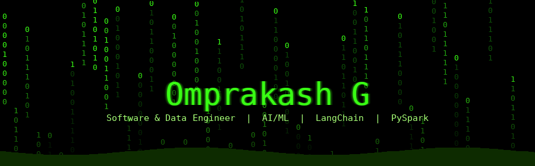

<div align="center">



[](https://git.io/typing-svg)


[](https://github.com/Omprakash1101)
[](https://leetcode.com/u/Omprakash_11)

</div>

---

## 🧬 About Me

```python
class SoftwareDataEngineer:
    def __init__(self):
        self.name        = "Omprakash G"
        self.location    = "Chennai, India"
        self.education   = "B.Tech IT — Easwari Engineering College (2022-2026)"
        self.cgpa        = "7.88 / 10"
        self.role        = "Software and Data Engineer | AI/ML"
        self.email       = "omprakashgopi2k05@gmail.com"
        self.expertise   = ["LangChain Agents", "PySpark", "ML Pipelines", "React + Django"]
        self.leetcode    = "450+ problems solved"
        self.fun_fact    = "I turn messy datasets into clean decisions"

    def say_hi(self):
        print("Thanks for visiting! Let's build something intelligent. 🤖")

me = SoftwareDataEngineer()
me.say_hi()
```

---

## 🧠 Skills & Tech Stack

<div align="center">

### 🤖 AI / ML & Data Science


### 📊 Big Data & Engineering


### 🖥️ Frontend & Backend


### ☁️ Cloud, DevOps & Tools


### 🗄️ Databases


</div>

---

## 💼 Experience

<details open>
<summary><b>🏢 AI/ML Intern — Widezo Pvt Ltd, Puducherry</b> &nbsp;|&nbsp; Dec 2024 – Jan 2025</summary>
<br>

Live Project: [tickets-v1.streamlit.app](https://tickets-v1.streamlit.app)

- 🤖 Developed an AI messaging agent that processed **30K+ weekly emails**, improving efficiency by **50–80%**
- 🧠 Built with **LangChain** and **Google Generative AI** for advanced contextual NLP
- 🦙 Integrated **Ollama** for local LLM inference; pipeline version-controlled on **GitHub**

</details>

---

## 🌟 Featured Projects

### 🖥️ [Code Visualizer](https://code-visualizer-pearl.vercel.app)
> *Interactive platform that visually explains program execution*

Created a visualization platform improving **debugging efficiency** and **algorithm comprehension**. CI/CD via GitHub Actions.

`React` `Django` `GitHub Actions`
&nbsp;·&nbsp; [🚀 Live Demo](https://code-visualizer-pearl.vercel.app) &nbsp;·&nbsp; [📂 Source](https://github.com/Omprakash1101)

---

### 🏥 [Healthcare Provider Fraud Detection](https://colab.research.google.com/drive/1irdqZmhPT0hYSBK7wvwm9_m0mTguTWts?usp=sharing)
> *Ensemble ML system to detect fraudulent healthcare providers*

Feature engineering, **SMOTEENN balancing**, and ensemble of LR + RF + XGBoost — achieving **~0.95 AUC**.

`Pandas` `NumPy` `Scikit-learn` `XGBoost`
&nbsp;·&nbsp; [📓 Open in Colab](https://colab.research.google.com/drive/1irdqZmhPT0hYSBK7wvwm9_m0mTguTWts?usp=sharing)

---

### 🚚 [Delivery Duration Prediction](https://github.com/Omprakash1101/Delivery_Duration_Prediction)
> *Big data EDA and ML on large-scale delivery datasets*

Distributed EDA with **PySpark** on **Databricks** to engineer features and predict delivery durations.

`PySpark` `Pandas` `Databricks`
&nbsp;·&nbsp; [📂 GitHub Repo](https://github.com/Omprakash1101/Delivery_Duration_Prediction)

---

## 🏅 Certifications

| Certificate | Issuer | Date | Credential ID |
|---|---|---|---|
| 📊 Data Analytics Job Simulation | Deloitte via Forage | Oct 2025 | `QE6bx5RDs9N2KFfod` |
| 🗄️ SQL (Advanced) | HackerRank | Aug 2025 | `94D54CBB8A3C` |

---

## 📊 GitHub Stats

<div align="center">


[](https://git.io/streak-stats)

</div>

---

## 🤝 Let's Connect

<div align="center">

[](https://github.com/Omprakash1101)
[](https://linkedin.com/in/omprakash-g-a8a906244)
[](https://leetcode.com/u/Omprakash_11)
[](mailto:omprakashgopi2k05@gmail.com)
[](https://tickets-v1.streamlit.app)

</div>

---

<div align="center">

*"Without data, you're just another person with an opinion."* — W. Edwards Deming

**`>>> print("Thanks for visiting — let's build! 🟢")`**

</div>
